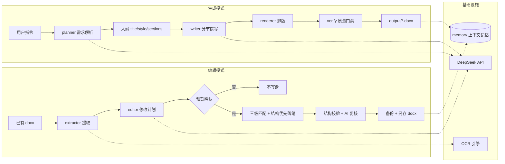

# WordAgent · AI 智能 Word 文档助手

> 输入一句自然语言指令，自动生成排版规范的 `.docx` 文档；或对已有文档按自然语言精准修改。
> 面向「重要文件」场景设计：模板 100% 继承、自动备份、程序化质量门禁、文档内要求自动读取。


---

## 目录

- [项目简介](#项目简介)
- [功能特性](#功能特性)
- [技术栈](#技术栈)
- [系统架构](#系统架构)
- [核心设计](#核心设计)
- [快速开始](#快速开始)
- [命令行用法](#命令行用法)
- [项目结构](#项目结构)
- [测试](#测试)
- [打包发布](#打包发布)
- [许可证](#许可证)

---

## 项目简介

WordAgent 是一个 **PC 端 AI 文档 Agent**，把「写 Word / 改 Word」变成一句自然语言：

- **生成模式**：`“写一份数据库课程实验报告，附带数据表与运行截图”` → 自动完成 需求解析 → 大纲规划 → 分节撰写 → 排版输出，得到可直接使用的 `.docx`。
- **编辑模式**：选择已有 `.docx`，用自然语言描述修改（改段落、增删章节、调整样式、填写表格），AI 生成原子修改计划，逐条校验后精确落笔，原文件自动备份。
- **模板驱动**：参考文件中的 `.docx` 模板会被完整读取（页面、字体、标题层级、表格、页眉页脚），生成结果严格遵循模板；模糊的图片/PDF 模板通过 OCR 识别章节结构后照样工作。

它围绕「重要文件」场景设计，把**格式继承、安全落笔、可验证性**放在第一位——这正是它与普通“聊天生成文本”类工具的本质区别。

## 功能特性

- 🧠 **任务拆解**：生成模式把指令拆成结构化大纲（标题/层级/风格/文档类型）；编辑模式把修改拆成原子操作（替换 / 插入 / 删除 / 改样式）。
- 🎨 **专业排版**：A4 页面、中文字体（汉字宋体 + 西文 Times New Roman 分离）、标题分级、目录域（打开自动更新）、页码、表格/列表/代码块/引用。
- 📋 **排版标准库**：内置 国标公文（GB/T 9704）、学术论文（GB/T 7714）、实验报告、商务、会议纪要、周报 等 8 套标准；支持 `standards/*.json` 自定义学校/公司的专属格式。
- 📎 **参考文件注入**：附加 图片 / 文本 / csv / docx 作为参考，正文自动引用其数据；图片真实嵌入文档并带图注。
- 🖼️ **多模态兜底**：DeepSeek 文本模型不具备多模态能力，WordAgent 用本地 OCR（RapidOCR + OpenCV）把参考图片/扫描版模板的文字读出来，再交给大模型理解。
- 📑 **模板填写模式**：直接在给定模板中填写——保留模板的信息表、表格、页眉页脚与全部格式，AI 按标题定位填入章节、按表头追加数据行，输出填写完成度报告。
- ✅ **程序化质量门禁**：生成/编辑完成后本地自动校验 8 项（标题层级、空段污染、Markdown 残留、字体一致性、表格边框、内容充实度、图片图注、文档完整性），可安全修复的项自动修复，**全程不消耗 token**。
- 🔒 **重要文件安全机制**：自动备份、默认另存、先校验后落笔（任一目标不匹配整体中止不写盘）、修改计划预览确认、AI 复核、三级目标匹配 + 歧义人工选择。
- 💾 **上下文记忆**：历史指令与结果持久化，新任务自动参考；GUI 侧边栏一键打开最近文档。
- 🖥️ **成熟 PC 软件**：安装包 + 绿色版双形态，开始菜单/桌面快捷方式、一键卸载、深色/浅色双主题、API Key 可在界面自行设置。

## 技术栈

| 层 | 技术 | 用途说明 |
| --- | --- | --- |
| 语言 | Python 3.12 | 全栈（GUI / 文档处理 / AI 编排） |
| 桌面 UI | `customtkinter` | 深色/浅色双主题桌面客户端；后台线程 + 事件队列避免界面卡顿 |
| Word 生成 | `python-docx` | 直接操作 OpenXML：样式、表格、页眉页脚、目录/页码域、字体（eastAsia/latin 分离） |
| Word 解析 | `python-docx` | 编辑模式把 docx 提取为结构化 Markdown（保留段落/表格/批注/页眉页脚/文本框要求） |
| PDF 解析 | `pymupdf` (fitz) | PDF 模板转图片，交给 OCR 识别章节结构 |
| 图像识别 | `rapidocr-onnxruntime` + `opencv-python` + `numpy` + `Pillow` | 本地 OCR：模糊模板识别、参考图片文字提取（不依赖大模型视觉能力） |
| 大模型 | DeepSeek API（`deepseek-v4-flash`） | 需求解析（JSON 结构化输出）、分节写作（并发波次 + 上下文衔接）、编辑计划生成、AI 复核 |
| 配置 | `python-dotenv` + `.env` | API Key / 模型 / 超时 / 并发度集中管理，GUI 内也可直接设置 |
| 打包分发 | `PyInstaller` + NSIS | 绿色免安装版 + 一键安装/卸载的 Windows 安装包 |

**AI 编排链路（officecli 方法论本地化）**

| 阶段 | 对应实现 |
| --- | --- |
| Analyze | `extractor.py` 读取文档全文 + 文档内要求（批注/页眉页脚/文本框）+ 参考文件注入 |
| Plan | `editor.py` 把自然语言翻译成原子操作 JSON，`planner.py` 把生成指令翻译成大纲 JSON |
| Structure → Content | 落笔时「结构操作（删除/改样式/新增章节）优先，内容替换后置」，目标冲突时保持原序 |
| Verify | `verify.py` 程序化质量门禁 + `editor.py` AI 复核（建议模式，不自动越权改稿） |

## 系统架构



**核心模块**

| 模块 | 职责 |
| --- | --- |
| `agent/planner.py` | 指令 → 大纲：识别文档类型/学科方向（本地关键词强制纠偏，如“数据库实验报告”不会误判成物理报告）、排版标准 |
| `agent/writer.py` | 大纲 → 分节正文：短文档一次成文，长文档波次并发，上下文摘要衔接，失败自动重试 |
| `agent/renderer.py` | Markdown → docx：模板预设 > 标准预设 > 通用风格的排版优先级，样式级字体统一 |
| `agent/extractor.py` | docx → 结构化 Markdown：段落/表格/合并单元格去重/文档内要求提取 |
| `agent/editor.py` | 修改计划 → 原子落笔：三级目标匹配、结构优先重排、全量校验、备份另存、AI 复核 |
| `agent/templater.py` | 模板填写：按标题定位填章节、按表头追加数据行、输出完成度报告 |
| `agent/template_reader.py` | docx 模板解析：页面/字体/标题结构/正文要求 |
| `agent/template_scanner.py` | 图片/PDF 模糊模板：OCR 识别章节结构并映射 |
| `agent/verify.py` | 程序化质量门禁：8 项本地校验 + 安全自动修复 |
| `agent/memory.py` | 上下文记忆持久化 |
| `agent/refdocs.py` | 参考文件收集（文本/csv/docx/图片 OCR） |

## 核心设计

### 1. 模板即参考文件（格式 100% 继承）

添加 `.docx` 作为参考文件时，WordAgent 会自动把它当作模板：读取页面尺寸/边距、中英文字体（eastAsia + latin）、标题层级结构、表格与页眉页脚；生成时**章节结构严格按模板**，AI 只负责填充各节内容。模板正文里写的要求/说明也会注入提示词，保证“模板说了什么就必须遵守”。

### 2. 文档内要求自动读取

编辑已有文档时，批注、页眉页脚、文本框里的要求（如格式、字数、数据安排）会被提取并注入修改计划提示——不读文档直接改是此前“完全没按要求”的根因，现在已修复。

### 3. 程序化质量门禁（不消耗 token）

officecli Verification Gate 的本地化实现，生成/编辑/模板填写完成后自动运行：

- 文档可打开（完整性）
- 标题层级（无跳级、无空标题、正式报告必须有 H1）
- 空段污染（连续空段压缩）
- Markdown 残留（`**` / 反引号 / 未转换表格行清理）
- 段落内字体混合检测 + 回退字体（Calibri/等线）归一
- 表格边框（无边框自动补 Table Grid）
- 章节内容充实度（防“没写后续”的半截内容）
- 图片图注

能安全修复的项自动修复并复检；不能修的以警告形式列在日志里，供人工确认。

### 4. 编辑落笔安全

- **三级目标匹配**：精确 → 包含 → 近似（相似度），标点/空格/加粗标记差异自动容错。
- **先全量校验后落笔**：任一目标找不到或有歧义 → 整体中止，不写盘。
- **歧义人工选择**：一个目标匹配多处时弹窗让用户选择，不自动猜。
- **结构优先重排**：删除/改样式/新增章节先落笔、文本替换后落笔（officecli「先结构后内容」），目标冲突时保持原序。
- **自动备份 + 默认另存**：修改前原文件备份到 `output/backups/`，默认另存为「原名_修改版_时间戳.docx」。

## 快速开始

```bash
# 1. 安装依赖（Python 3.10+）
pip install -r requirements.txt

# 2. 配置 API Key（任选一种）
cp .env.example .env          # 编辑 .env 填入 DEEPSEEK_API_KEY=sk-xxx
# 或 export DEEPSEEK_API_KEY=sk-xxx
# 或 GUI 设置面板里填写 / 命令行 --api-key sk-xxx

# 3. 启动桌面版
python gui.py                 # 或双击「启动桌面版.bat」
```

> 模型默认 `deepseek-v4-flash`（省 token 的推理模型），可在 `.env` 中修改
> `DEEPSEEK_MODEL` / `DEEPSEEK_BASE_URL`，接口地址与模型完全可自定义。

## 命令行用法

```bash
# 生成
python main.py --once "写一份产品需求文档"

# 生成 + 参考文件（实验报告附数据表与截图）
python main.py --once "写一份实验报告，主题为传感器标定" --refs 测量数据.csv 实验截图.png

# 指定排版标准 / 风格
python main.py --once "按国标公文格式写一份会议纪要" --standard 公文
python main.py --once "写一份市场推广方案" --style business

# 编辑（默认另存新文件，先预览询问）
python main.py --file 报告.docx --once "把标题改成《2026年度报告》"

# 编辑：只预览修改计划，不写盘
python main.py --file 报告.docx --once "删除最后一段" --preview

# 编辑：确认后覆盖原文件（自动备份）
python main.py --file 报告.docx --once "新增一节：风险分析" --overwrite --yes

# 模板填写
python main.py --once "填写……" --fill-template 模板.docx
```

交互式命令：`/help`、`/memory`、`/clear`、`/output`、`/set-output <路径>`、`/file <路径>`（进入编辑模式）、`/new`（退出编辑模式）、`/exit`。

**无需 API Key 体验排版效果**：

```bash
python demo.py   # 生成 output/示例_排版演示.docx
```

## 项目结构

```
wordagent/
├── gui.py                  # 桌面版入口（customtkinter）
├── main.py                 # 控制台版入口（argparse CLI）
├── demo.py                 # 排版演示（无需 API Key）
├── requirements.txt        # Python 依赖
├── .env.example            # 配置模板（API Key / 模型 / 并发度）
├── installer.nsi           # NSIS 安装包脚本（一键安装/卸载/快捷方式）
├── WordAgent.spec          # PyInstaller 打包配置
├── assets/                 # 品牌图标
├── standards/              # 排版标准库（JSON 可扩展）
├── agent/                  # 核心包（见上表「核心模块」）
│   ├── planner.py / writer.py / renderer.py     # 生成链路
│   ├── extractor.py / editor.py / templater.py  # 编辑与模板填写链路
│   ├── template_reader.py / template_scanner.py # 模板解析（docx / 图片 / PDF）
│   ├── verify.py           # 程序化质量门禁
│   ├── memory.py / refdocs.py / image_reader.py
│   ├── llm.py / config.py
│   └── __init__.py
└── tests/
    └── smoke_test.py       # 离线冒烟测试（无需 API）
```

## 测试

```bash
python tests/smoke_test.py
```

离线冒烟测试覆盖（不调用真实 API）：生成全流程、参考文件与图片嵌入、编辑另存+备份、编辑覆盖+备份、校验失败自动中止不写盘、歧义处理、表格行锚定插入、插入位置正确性、AI 复核循环、质量门禁自动修复。

## 打包发布

```bash
# 1. 绿色版（dist/WordAgent/WordAgent.exe）
python -m PyInstaller --clean --noconfirm WordAgent.spec

# 2. 安装包（installer/WordAgent_Setup_<版本>.exe）
makensis installer.nsi
```

安装版自动把输出与记忆放到「我的文档/WordAgent」，卸载时**不丢失用户文档**；提供开始菜单/桌面快捷方式与一键卸载。

## 许可证

MIT License — 由 **eternalhope** 维护。欢迎 Star、Issue 与 PR。
